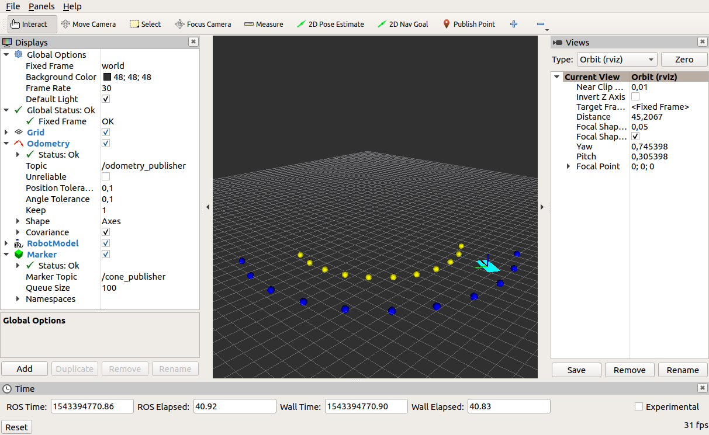

# rviz_sandbox

### Description

Sandbox for rviz where publisher, urdf and tf-functions will be tested.

### Evaluation of RVIZ

You can find a detailed evaluation of RVIZ and its features in:
[evaluation.md](evaluation.md)


### Prerequisites

* installed ROS (used melodic)
* copy this package into the "src"-folder of your catkin-workspace


### Getting this thing running

Build and start the simulation:

```
cd ~/catkin_ws
catkin_make
roslaunch rviz_sandbox circle_track_with_cones.launch
```

The "circle_track_with_cones.launch"-file does:

* start rviz with urdf model
* start odometry_publisher (drive a circle with the car)
* start cone_publisher (publish blue and yellow cones)

On top of the urdf-model are axes displayed in the colors rgb.
(R=X, G=Y, B=Z)


